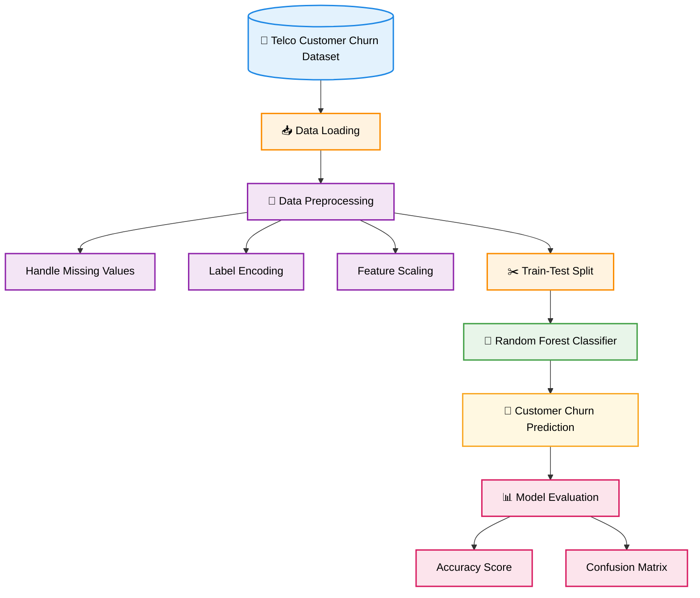
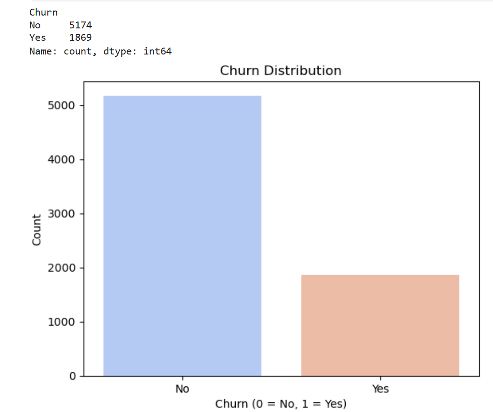
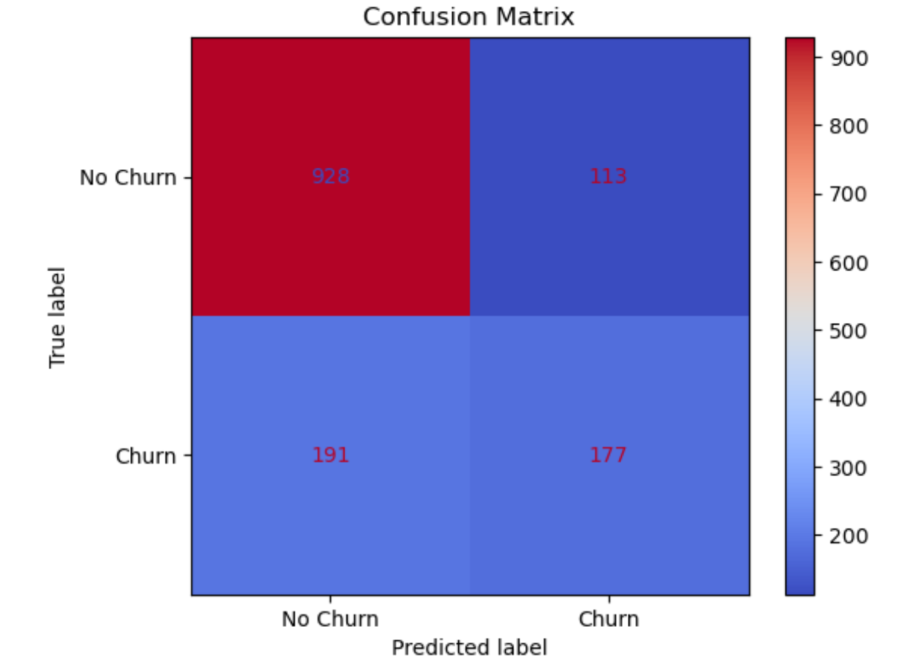

# 📉 Customer Churn Prediction using Python

> A beginner Machine Learning project that analyzes customer churn patterns and predicts whether a customer is likely to leave a telecom service using the Telco Customer Churn dataset.


---

# 📌 Project Overview

Customer churn occurs when customers stop using a company's services, leading to revenue loss and reduced customer retention. Predicting churn helps businesses identify customers who may leave and take proactive measures to improve retention.

In this project, I analyzed the **Telco Customer Churn** dataset and built a **Random Forest Classifier** to predict whether a customer is likely to churn. The project covers data preprocessing, exploratory data analysis, model training, and performance evaluation using Python and Scikit-learn.

---

# 🎯 Problem Statement

The objective of this project is to build a classification model that predicts customer churn based on customer demographics, subscription details, and service information.

Some of the questions explored during the analysis include:

- 📊 How is customer churn distributed in the dataset?
- 🌐 What customer information is available for prediction?
- 🤖 Can a Machine Learning model predict customer churn?
- 📈 How well does the model perform on unseen data?

---

## ✨ Project Highlights

- 📊 Performed Exploratory Data Analysis (EDA) on the Telco Customer Churn dataset.
- 🧹 Cleaned and preprocessed the dataset.
- 🔤 Encoded categorical variables using LabelEncoder.
- ⚖️ Applied feature scaling using StandardScaler.
- 🌲 Trained a Random Forest Classifier.
- 📈 Evaluated the model using Accuracy Score and Confusion Matrix.
- 📒 Developed using Jupyter Notebook.

---

# 🛠️ Tech Stack

- Python
- Pandas
- NumPy
- Matplotlib
- Seaborn
- Scikit-learn
- Jupyter Notebook

---

# 📂 Project Structure

```text
Customer-Churn-Prediction/
│
├── data/
│   └── Telco-Customer-Churn.csv
│
├── notebooks/
│   └── Customer_Churn_Prediction.ipynb
│
├── images/
│   ├── dataset_preview.png
│   ├── churn_distribution.png
│   ├── confusion_matrix.png
│   └── project_flow.png
│
├── requirements.txt
├── README.md
└── LICENSE
```

---

# 📊 Dataset Information

The Telco Customer Churn dataset contains customer information such as:

- Customer ID
- Gender
- Senior Citizen
- Partner
- Dependents
- Tenure
- Phone Service
- Multiple Lines
- Internet Service
- Online Security
- Online Backup
- Device Protection
- Tech Support
- Streaming TV
- Streaming Movies
- Contract Type
- Paperless Billing
- Payment Method
- Monthly Charges
- Total Charges
- Churn (Target Variable)

---

# 🔄 Project Workflow



---

# 🔍 Project Workflow

## 1️⃣ Data Loading

- Imported the dataset using Pandas.
- Displayed the first few records.
- Explored the dataset structure.

## 2️⃣ Data Preprocessing

- Converted **TotalCharges** into numerical format.
- Handled missing values using median imputation.
- Encoded categorical variables using **LabelEncoder**.
- Removed unnecessary columns.
- Split the dataset into training and testing sets.
- Applied **StandardScaler** for feature scaling.

## 3️⃣ Exploratory Data Analysis

Performed basic exploratory analysis including:

- Dataset summary
- Missing value inspection
- Churn distribution visualization

## 4️⃣ Model Training

Built a classification model using:

- **Random Forest Classifier**

The trained model was then used to predict customer churn on the test dataset.

## 5️⃣ Model Evaluation

The model was evaluated using:

- Accuracy Score
- Confusion Matrix

**Model Accuracy:** **78%**

---

# 📈 Visualizations

The project includes visualizations such as:

- 📊 Churn Distribution
- 📈 Confusion Matrix

---

# 💡 Key Insights

- The dataset contains more non-churn customers than churn customers.
- The Random Forest model achieved an accuracy of approximately **78%**.
- The confusion matrix shows that the model predicts non-churn customers more accurately than churn customers.
- Some churning customers were misclassified, indicating that further model tuning could improve performance.

---

# 🚀 Getting Started

## Clone the Repository

```bash
git clone https://github.com/yourusername/Customer-Churn-Prediction.git
```

## Install Dependencies

```bash
pip install -r requirements.txt
```

## Launch Jupyter Notebook

```bash
jupyter notebook
```

Open:

```text
notebooks/Customer_Churn_Prediction.ipynb
```

---

# 📸 Sample Outputs

### Churn Distribution



### Confusion Matrix



---

# 📚 Skills Demonstrated

- Data Cleaning
- Data Preprocessing
- Exploratory Data Analysis (EDA)
- Data Visualization
- Machine Learning
- Classification
- Model Evaluation
- Python for Data Analysis

---

# 👩‍💻 Author

**Latika Manoj Ray**

Aspiring Software Engineer | Python | SQL | Machine Learning | Data Analytics

---

⭐ If you found this project useful, consider giving the repository a **Star**!
